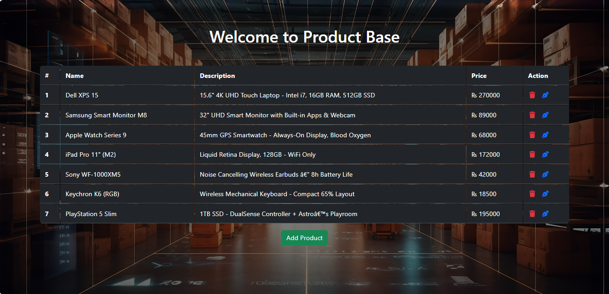
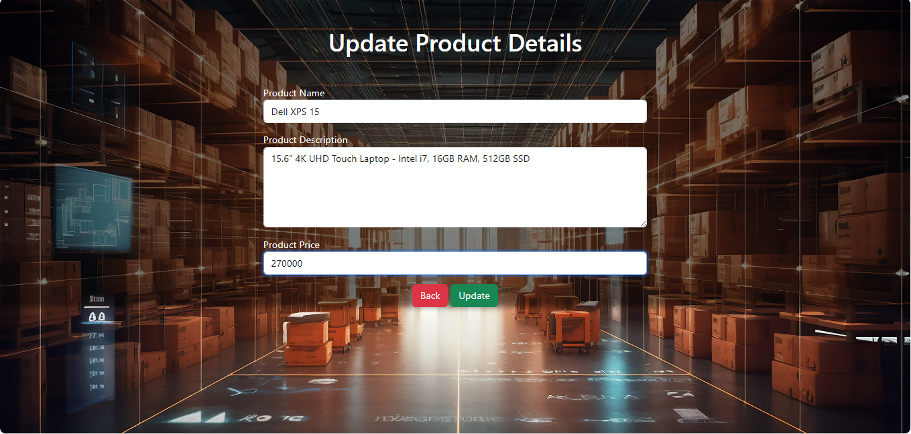
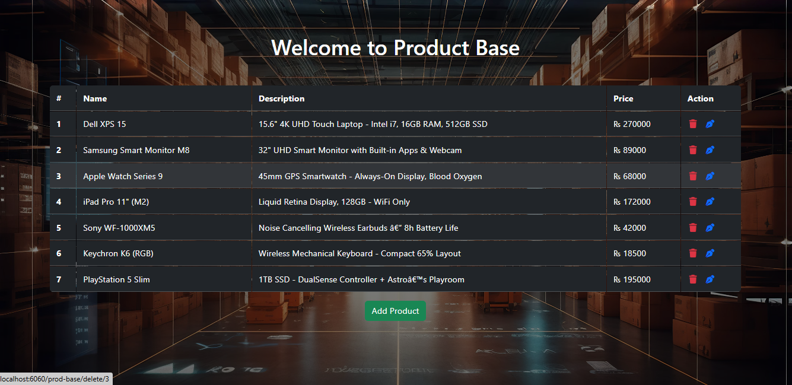
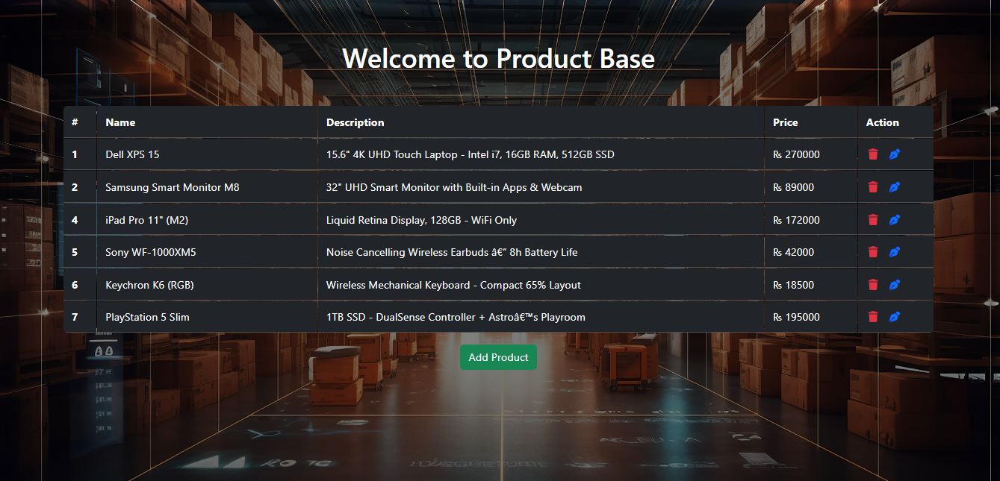

# ProdBase - Spring MVC + Hibernate Product Management App

**ProdBase** is a simple CRUD (Create, Read, Update, Delete) web application built using:

- Spring MVC
- Hibernate ORM
- JSP & JSTL
- MySQL (Backend DB)
- Bootstrap (Frontend UI)

---

## Features

- View all products in a styled table.
- Add a new product with name, description, and price.
- Edit/update existing products.
- Delete products with confirmation.

---

## Technologies Used

- Spring Framework (MVC, ORM)
- Hibernate
- MySQL
- JSP, JSTL
- Apache Maven
- Bootstrap

---

## Screenshots

### Home Page (Product Listing)



### Add Product


### Update Product



### Delete Product





---

## Setup Instructions

1. Clone the repository
   ```bash
   git clone https://github.com/Shehryar2000/prod-base.git
